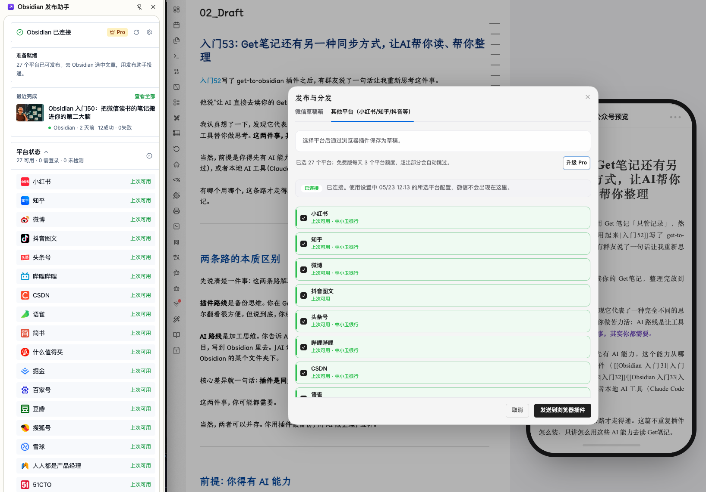
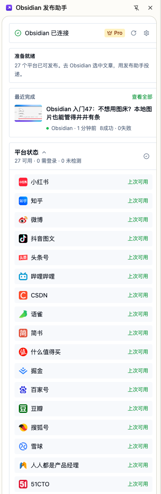
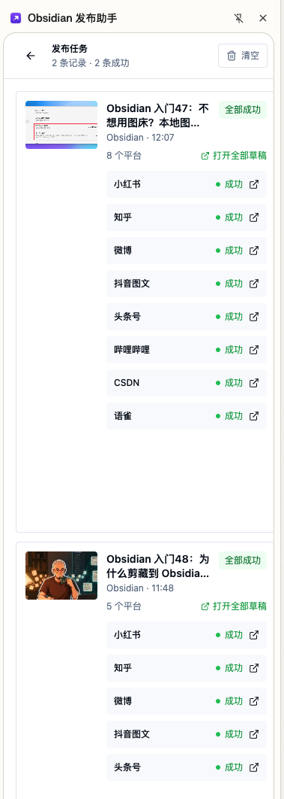
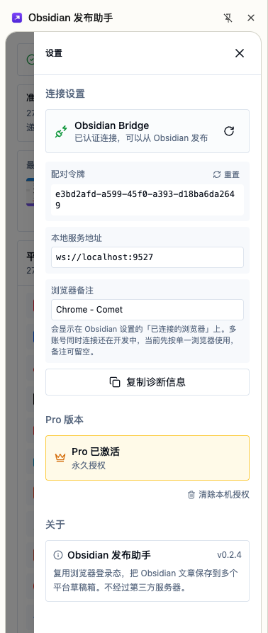

简体中文 | [English](./README.en.md)

# 📝 微信公众号排版转换器 (WeChat Converter)

**让技术写作回归优雅与纯粹。**

一款专为 Obsidian 打造的公众号与多平台发布增强插件。它不仅仅是一个转换工具，更是您内容创作流中的"数字化妆师"。我们解决了 Obsidian 到微信公众号排版的"最后一公里"问题，也把同一篇文章继续送往知乎、掘金、CSDN 等内容平台，让您专注于内容创作，无需为繁琐的格式调整和重复发布而分心。

只需一键，即可将您的 Markdown 笔记转换为符合微信生态美学、阅读体验极佳的 HTML；也可以在发布窗口选择其他平台，通过 Obsidian 发布助手浏览器插件保存为各平台草稿。无论是代码块、引用、列表、本地图片还是公式图表，都尽量保持从 Obsidian 到发布端的完整呈现。


> 本项目基于开源项目 [ai-writing-plugins](https://github.com/Ceeon/ai-writing-plugins) 进行深度重构与迭代开发。我们致力于打造 Obsidian 生态中体验最好的公众号排版工具。

如果这个插件帮你节省了公众号排版、复制或同步草稿箱的时间，欢迎[支持项目继续维护](./docs/support.md)。

## English summary

WeChat Converter is an Obsidian plugin for Chinese creators who publish Markdown notes to WeChat Official Accounts and other Chinese content platforms. It converts Markdown into WeChat-ready HTML, supports live preview, rich copy, WeChat draft sync, local image handling, LaTeX / Mermaid export, and optional multi-platform draft delivery through the companion browser extension.

Privacy and permissions: the plugin has no client-side telemetry. Network access, local file reads, and clipboard writes are only used when you explicitly run the related publishing, preview, copy, AI, or multi-platform delivery features.

## 🔐 隐私与权限说明

插件默认在你的 Obsidian 本地运行，不包含客户端遥测，也不会自动上传你的笔记内容。以下能力只会在你主动使用对应功能时触发：

- **网络请求**：同步微信公众号草稿时会访问微信官方 API；配置 API 代理时会访问你填写的代理地址；使用 AI 编排时会访问你配置的 AI Provider；使用多平台发布时会连接本机浏览器插件服务。
- **本地文件读取**：处理当前笔记引用的本地图片、封面和 Mermaid / LaTeX 导出资源时，会读取必要的 vault 内文件。
- **剪贴板**：点击复制按钮时，插件会把当前预览内容写入系统剪贴板，便于粘贴到微信公众号后台。
- **第三方账号**：微信公众号同步需要你自行配置 AppID / AppSecret；其他平台发布由「Obsidian 发布助手」浏览器插件使用你浏览器中已有的登录态保存草稿。
- **Pro / 浏览器插件**：多平台发布和 Pro 授权能力由配套浏览器插件处理；Obsidian 插件侧负责写作、排版、平台选择和任务投递。


## 🚀 v2.8.0 新功能：多平台一键分发

现在，插件不再只服务于微信公众号。你可以在同一个"发布与分发"窗口里，把同一篇文章继续投递到知乎、掘金、CSDN、小红书、头条号等 20+ 内容平台的草稿箱，由配套的「Obsidian 发布助手」浏览器插件驱动。

- **微信仍走官方 API**：公众号草稿箱继续使用插件自己的 AppID / AppSecret 同步链路，保留封面、摘要、多账号和发布默认值。
- **其他平台走浏览器插件**：知乎、掘金、CSDN 等平台通过「Obsidian 发布助手」使用浏览器登录态保存为草稿，不需要在 Obsidian 里重复登录每个平台。
- **发布前可选平台**：在发布弹窗中切换到“其他平台”，勾选目标平台后发送到浏览器插件。
- **轻量状态提示**：设置页和发布窗口会显示桥接连接状态、已选平台和上次检测到的登录状态，最终结果以浏览器插件任务窗口为准。
- **适合多渠道创作者**：同一篇 Obsidian 笔记可以先发公众号，再同步到多个内容平台草稿箱，最后分别检查排版并手动发布。

<table>
  <tr>
    <th align="center">发布弹窗：选择目标平台</th>
    <th align="center">浏览器插件：平台列表</th>
    <th align="center">发布任务结果</th>
  </tr>
  <tr>
    <td align="center"></td>
    <td align="center"></td>
    <td align="center"></td>
  </tr>
</table>


## 💡 核心升级点 (Key Highlights)

相较于原版，我们**重写了核心渲染逻辑**并新增了大量实用功能，旨在实现真正的**"所见即所得"**：

1.  **🌐 多平台发布 (Multi-platform Publishing) ⭐ v2.8.0 新增**
    - **一处写作，多处分发**：在 Obsidian 中完成写作和排版后，可继续发送到知乎、掘金、CSDN、语雀、小红书等平台草稿箱。
    - **「Obsidian 发布助手」浏览器插件接管平台登录态**：其他平台通过浏览器已有登录态保存草稿，Obsidian 不内嵌平台登录，也不接管 Cookie。
    - **微信与其他平台分工清晰**：微信公众号继续使用插件自己的官方 API 链路，其他平台走「Obsidian 发布助手」浏览器插件链路。
    - **发布窗口直接选择平台**：在“发布与分发”窗口切换到“其他平台”，勾选平台后发送到浏览器插件。
    - **任务结果回到插件查看**：草稿链接、失败原因和单平台重试由 「Obsidian 发布助手」任务窗口处理，减少 Obsidian 里的等待和阻塞。

2.  **➗ 完美支持数学公式 (Math Support) ⭐ v2.1 新增**
    - **LaTeX 全面支持**：直接书写 `$E=mc^2$` 或 `$$...$$`，所见即所得。
    - **纯矢量 SVG 渲染**：采用独家无缓存技术，将公式转为独立的 SVG 矢量图，无论放大多少倍都清晰锐利。
    - **抗清洗**：完美抵抗微信公众号的样式清洗，不再出现乱码或被吞掉的情况。

    <p align="center">
      
    </p>

3.  **📊 Mermaid 图表支持**
    - **沿用 Obsidian 原生渲染**：在 Obsidian 里能正常显示的 Mermaid 图表，会在插件预览中继续显示。
    - **导出自动转 PNG**：复制到公众号或同步到草稿箱时，会自动将 Mermaid 图表栅格化为 PNG，避免 SVG 过长导致微信拦截。
    - **保留图表原色**：导出时不会套用数学公式的改色逻辑，尽量保持 Mermaid 主题与连线配色。

    <p align="center">
      
    </p>
    
4.  **🚀 一键同步到微信草稿箱 (v2.2 增强)**
    - **极速并发上传**：图片上传速度提升 300%，支持多线程并发处理，大图文章秒传。
    - **智能重试机制**：自动处理网络抖动与 Token 过期，全程零人工干预，稳如泰山。
    - **实时进度反馈**：新增精确的上传进度条 (e.g., "3/12")，让等待不再焦虑。
    - **安全防重**：严格的幂等性设计，杜绝因网络超时产生的重复草稿。
    - **告别复制粘贴**：直接将文章同步到微信公众号后台草稿箱，图片自动上传。
    - **智能封面处理**：如果你的文档头部信息（frontmatter）里写了 `cover`，会优先用它做封面；没写就自动用正文第一张图，也可以手动换图。
    - **智能摘要辅助**：如果 frontmatter 里写了 `excerpt`，会优先用它；没写就自动截取前 45 个字，也可以手动改。
    - **同步后自动清理（可选）**：发送成功后，可以自动删除你在设置里指定的目录（默认关闭）。
    - **目录支持变量**：清理目录支持 `{{note}}`，会自动替换成当前文档名，例如 `published/{{note}}_img`。
    - **可回收**：支持优先移动到系统回收站，误删可恢复。
    - **多账号管理**：支持最多 5 个公众号账号配置，快速切换同步。
    - **账号级发布默认值**：可为每个公众号账号单独设置默认原文链接、留言开关和“仅粉丝可留言”。
    - **Cloudflare 代理支持**：解决 IP 白名单频繁变化问题，[查看部署指南](#-代理设置解决-ip-白名单问题)。

    <p align="center">
      
    </p>

5.  **🎛 全新可视化设置面板 (Settings Panel)**
    - 告别繁琐的代码修改！我们内置了直观的设置面板，让您可以实时调整字体、字号、主题色等参数，一切尽在掌握。

    <table>
      <tr>
        <th align="center">浅色模式</th>
        <th align="center">深色模式</th>
      </tr>
      <tr>
        <td align="center"></td>
        <td align="center"></td>
      </tr>
    </table>

6.  **🎨 三大专家级主题 (Premade Themes)**
    - 内置 **简约 (Simple)**、**经典 (Classic)**、**优雅 (Elegant)** 三款精心设计的主题，覆盖从技术博客到人文随笔的各种场景。
    - 引用块支持更克制的**中性灰样式**，减少大面积主题色对正文阅读的干扰。
    - Callout 支持按语义类型高亮，如 `note`、`tip`、`warning`、`danger` 等；未知类型会自动回退为信息类样式。

7.  **🖼️ 强大的本地图片支持 (Local Image Support)**
    - **打破图床限制**：完美支持 Obsidian 的本地图片引用（包括 `![[Wiki Link]]` 和 ``）。
    - **头像上传**：支持直接上传本地图片作为作者头像，插件会自动转码为 Base64。
    - **强大的本地图片支持**：无论是相对路径、绝对路径还是 WikiLink，都能自动识别并压缩。
    - **GIF 动图支持**：针对 GIF 格式特别优化，自动绕过压缩流程，完美保留完整动画帧。
    - **图片左右滑动查看**：多张图片可以组织成横向滑动图片块，适合步骤截图、对比图、长图拆分和敏感图片提示。
    - **温馨提示**：建议图片（尤其是 GIF）保持在 10MB 以内，以获得最佳的处理速度和公众号兼容性。超过 10MB 时插件会弹出提醒。

8.  **⚡️ 实时渲染预览 (Live Preview)**
    - 右侧预览区实现了**毫秒级响应**的实时渲染。您在左侧 Markdown 编辑的每一个字符，都会即时反馈在右侧的公众号预览视图中。
    - **📱 双模预览 (Dual Mode Preview)** ⭐ v2.2 新增
        - **手机仿真模式 (默认)**：提供逼真的 iPhone X 边框与刘海屏效果，支持深色模式适配，还原最真实的读者视角。
        - **经典全宽模式**：在设置中一键切换回无边框全屏预览，利用屏幕每一寸空间。
    - **↕️ 双向同步滚动 (Bidirectional Sync)**：无论是在左侧编辑还是右侧浏览，另一侧都会如影随形，精准对齐。

    <table>
      <tr>
        <th align="center">手机仿真模式</th>
        <th align="center">经典全宽模式</th>
      </tr>
      <tr>
        <td align="center"></td>
        <td align="center"></td>
      </tr>
    </table>

9.  **💻 Mac 风格代码块与样式还原**
    - 重新设计了代码块样式，支持 macOS 窗口风格及行号显示。
    - **1:1 完美还原**：我们在 Obsidian 预览区看到的样式（包括间距、颜色、边框、阴影），复制到微信后台后将**分毫不差**。
    - **宽表格横向滑动**：列数较多或内容较长的表格会自动保持可左右滑动，避免在手机端被强行压缩或截断。

    <p align="center">
      
    </p>

## 📖 使用方法

1. **唤起插件**
   - 点击 Obsidian 左侧边栏的 🪄 图标 (WeChat Converter)。
   - 或使用命令面板 (`Cmd/Ctrl + P`) 搜索并执行 "Open Wechat Converter"。

2. **预览与调整**
   - 插件会自动加载当前激活的笔记内容。
   - 在右侧面板中，您可以实时预览排版效果。

3. **一键复制**
   - 确认预览效果满意后，点击底部的 **[📋 复制到公众号]** 按钮。
   - 提示"已复制"后，直接在微信公众号后台编辑器中 `Ctrl/Cmd + V` 粘贴即可。

4. **一键同步到微信草稿箱** ⭐ 新功能
   - 先在插件设置里填好公众号账号（AppID / AppSecret）。
   - 点击 **[🚀 一键同步]**，选择账号后即可发送。
   - 每个公众号账号都可以单独配置发布默认值：
     - 默认原文链接
     - 默认开启留言
     - 默认仅粉丝可留言
   - 默认值读取规则：
     - 摘要优先读 `excerpt`
     - 封面优先读 `cover`
     - `cover_dir` 用于同步成功后的“自动清理目录”判断，不作为封面图来源
     - 如果没有，就自动回退到插件默认逻辑（摘要自动截取、封面取正文首图）
   - 你在弹窗里手动上传封面、手动改摘要，始终优先于自动值。
   - 发送成功后，文章会出现在公众号后台草稿箱。

5. **发送到其他内容平台** ⭐ v2.8.0 新增
   - 先安装 Obsidian 发布助手浏览器插件，并确保目标平台已经在浏览器里登录。
   - 在插件设置 → 其他平台 → 开启「启用浏览器插件发布」，填入浏览器插件中显示的连接令牌。
   - 点击“测试连接”，确认 Obsidian 能连接到浏览器插件。
   - 在设置页勾选想同步的平台；需要时可点击“读取已选平台状态”。
   - 回到转换器，点击 **发布与分发**，切换到 **其他平台**。
   - 勾选知乎、掘金、CSDN 等目标平台后，点击 **发送到浏览器插件**。
   - Obsidian 会把当前文章投递给 Obsidian 发布助手；后续草稿链接、失败原因和单平台重试请在浏览器插件任务窗口中查看。

   <p align="center">
     <br/>
     <sub>浏览器插件连接设置页（配对令牌 + Obsidian Bridge 已认证）</sub>
   </p>

### 横向滑动内容

#### 宽表格左右滑动

当 Markdown 表格列数较多、单元格内容较长，或在手机预览中超过正文宽度时，插件会自动给表格加上横向滚动容器。你不需要额外写语法，正常写 Markdown 表格即可：

```markdown
| 指标 | 第一季度 | 第二季度 | 第三季度 | 第四季度 | 备注 |
| --- | --- | --- | --- | --- | --- |
| 转化率 | 12.4% | 15.8% | 18.1% | 21.6% | 适合保留完整列宽 |
```

预览、复制到公众号、同步到草稿箱时，超宽表格都会尽量保持“左右滑动查看”，避免被压成很窄的列。

#### 图片左右滑动

如果你想让多张图片横向排列，并在预览或微信公众号里左右滑动查看，可以使用 Obsidian Callout 写法：

```markdown
> [!image-swipe] 左右滑动查看图片
> ![[步骤一.png]]
> ![[步骤二.png]]
> 
```

如果第一屏需要先展示敏感图片提示，可以使用：

```markdown
> [!image-sensitive] 此类图片可能引发不适，向左滑动查看
> ![[图片一.png]]
> ![[图片二.png]]
```

也可以先选中多行图片语法，再打开命令面板 (`Cmd/Ctrl + P`) 运行 `插入图片块` 或 `插入敏感图片块`，插件会自动帮你包裹成对应的 Callout。

### AI 编排（实验功能）

- 入口有两处：
  - 插件设置里的 `AI 编排`：用于配置 Provider、默认布局、默认颜色和缓存策略
  - 转换器顶部工具栏里的 `AI 编排`：用于对当前文章生成和应用版式
- 当前支持 3 类 Provider 接口：
  - OpenAI 兼容接口
  - Gemini 兼容格式
  - Anthropic 兼容格式
- 内置 3 套布局家族：
  - `原文增强型`：最接近普通预览，正文连续性更强
  - `教程卡片型`：更适合步骤拆解、清单、案例说明
  - `轻杂志型`：更强调留白、图文节奏和编辑感
- 可以选择 `自动配色`，也可以在生成前手动指定颜色方案。
- 生成后可以继续手动切换颜色方案，复用当前布局结构，不必每次都重新生成。
- 每个布局家族会保留当前文章最新的一份缓存；重新打开侧边栏后，可以直接应用匹配当前文章的缓存结果。
- 面板里可以直接看：
  - schema 校验提醒
  - 布局 JSON
  - 错误详情
  - 复制给 AI 的排查 Prompt
  - 当前 JSON 或错误详情
- 如果重新生成失败，上一版成功结果仍然可以保留，方便你继续预览和比较。

<table>
  <tr>
    <td align="center"><br/><sub>1. 配置 Provider 与 布局</sub></td>
    <td align="center"><br/><sub>2. 生成结果与缓存</sub></td>
    <td align="center"><br/><sub>3. 应用到预览区</sub></td>
  </tr>
</table>

<p align="center">
  <br/>
  <sub>AI 编排全局设置（Provider 与 缓存策略管理）</sub>
</p>

### 同步后自动清理（可选）

- 入口：插件设置 → 高级设置
- 默认是关闭的。
- 只有“发送到微信草稿箱成功”后，才会触发清理。
- 清理的是你在设置里填的目录（删目录，不是删单个文件）。
- 目录支持 `{{note}}`，会自动替换成当前文档名。
- 清理目录请填写 vault 内相对路径（不要填 `/Users/...` 或 `C:\\...` 这类绝对路径）。
- 清理成功后，如果文档里的 `cover` / `cover_dir` 指向这个已删除目录，插件会自动清空这些失效字段。
- 建议开启“使用系统回收站”，这样删错也能找回。
- 示例：`published/{{note}}_img`  
  如果当前文档名是 `post`，实际删除目录是 `published/post_img`。

### Mermaid 图表导出说明

- 在 Obsidian 预览里能正常显示的 Mermaid 图表，会尽量在插件预览里继续保持可见。
- 当你执行“复制到公众号”或“一键同步到草稿箱”时，插件会自动把 Mermaid 图表栅格化为 PNG。
- 这样做的目的不是改变样式，而是为了减少微信公众号对长 SVG、复杂 SVG 的清洗和拦截问题。
- 导出链路会尽量保留 Mermaid 原本的颜色，不会套用数学公式那一套 SVG 清理逻辑。


## ✍️ 中文标点标准化规则

插件支持在右侧排版 `setting panel` 中开启或关闭“正文标点标准化”：

- 入口：右侧排版 `setting panel` → `正文标点标准化`
- 作用范围：仅作用于预览 / 复制 / 同步结果
- 不会修改原始 Markdown 文件

### 已支持的替换规则

在**中文语境**下，插件会将常见英文半角标点替换为中文全角标点：

- `,` → `，`
- `.` → `。`
- `:` → `：`
- `?` → `？`
- `!` → `！`
- `;` → `；`
- `"..."` → `“...”`
- `(...)` → `（...）`

### 已保护的场景

以下内容会尽量保持原样，避免误伤技术文档：

- 行内代码与代码块，例如 `` `content` ``、` ```ts ... ``` `
- URL 与邮箱，例如 `https://example.com/a?b=1`、`support@example.com`
- 常见技术性括号表达式、数学记号、函数/调用语法，例如 `公式(x+y)`、`矩阵(A,B)`、`foo(bar, baz)`、`f(x, y)`
- 英文原句与数字小数点，例如 `Version 2.1 is stable.`
- 文件名、相对路径、Windows 路径，例如 `README.md`、`tests/foo.test.js`、`C:\Users\name\demo.md`
- 命令行参数与脚本名，例如 `--run`、`test:coverage`
- 环境变量赋值，例如 `NODE_ENV=production`
- 日期时间，例如 `2026-03-09 09:15:11`、`2026/02/13 23:00`
- Markdown 结构本身，例如表格分隔符、代码围栏、链接语法等

### 当前边界

- 这是**规则驱动**的标准化能力，不依赖模型。
- 它适合做“发布前质检”和“统一格式”，不适合做语义判断。
- 像 `...` / `......` 这类省略号写法会保留原样，不会强制改写。
- 像“并列词语之间把逗号改成顿号 `、`”这类规则目前**没有启用**，因为容易误改，后续如果要做，更适合放到 AI 精修能力里。

## 🎨 引用与 Callout 样式

- 入口：右侧排版 `setting panel` → 引用 / Callout 样式
- 现在支持两种整体模式：
  - `跟随主题`
  - `中性灰（推荐）`
- `中性灰` 模式更适合长文阅读，会明显减弱大面积主题色的存在感。
- Callout 会按语义类型自动着色，例如 `note`、`tip`、`warning`、`danger`。
- 对于插件还不认识的 Callout 类型，会统一回退为信息类样式，而不是随机继承当前主题色。

## 🔧 代理设置（解决 IP 白名单问题）

微信公众号 API 需要 IP 白名单验证。如果你使用 VPN 或动态 IP，可以通过 Cloudflare Worker 代理解决。

### 部署步骤

1. **创建 Cloudflare Worker**
   - 登录 [Cloudflare Dashboard](https://dash.cloudflare.com/)
   - 左侧菜单选择 **Workers & Pages** → **Create Application** → **Create Worker**
   - 命名（如 `wechat-proxy`）并点击 **Deploy**

2. **编辑 Worker 代码**

   点击 **Edit code**，替换为以下代码：

   ```javascript
   export default {
     async fetch(request, env) {
       const MAX_UPLOAD_BYTES = 10 * 1024 * 1024;
       const ALLOWED_METHODS = new Set(['GET', 'POST', 'UPLOAD']);
       const corsHeaders = {
         'Access-Control-Allow-Origin': '*',
         'Access-Control-Allow-Methods': 'POST, OPTIONS',
         'Access-Control-Allow-Headers': 'Content-Type',
       };

       const jsonResponse = (payload, status = 200) =>
         new Response(JSON.stringify(payload), {
           status,
           headers: {
             ...corsHeaders,
             'Content-Type': 'application/json; charset=utf-8',
           },
         });

       const isAllowedWechatUrl = (rawUrl) => {
         try {
           const parsed = new URL(rawUrl);
           return parsed.protocol === 'https:' && parsed.hostname === 'api.weixin.qq.com';
         } catch {
           return false;
         }
       };

       const toUint8Array = (base64) => {
         const binary = atob(base64);
         const bytes = new Uint8Array(binary.length);
         for (let i = 0; i < binary.length; i++) {
           bytes[i] = binary.charCodeAt(i);
         }
         return bytes;
       };
   
       // 处理 CORS 预检请求
       if (request.method === 'OPTIONS') {
         return new Response(null, { headers: corsHeaders });
       }
   
       if (request.method !== 'POST') {
         return jsonResponse({ error: 'Method Not Allowed' }, 405);
       }
   
       try {
         const body = await request.json();
         const { url, method = 'GET', data, fileData, fileName, mimeType } = body;
         const normalizedMethod = String(method || 'GET').toUpperCase();
         
         // 安全校验：只允许访问微信 API
         if (typeof url !== 'string' || !isAllowedWechatUrl(url)) {
           return jsonResponse({ error: 'Invalid URL. Only https://api.weixin.qq.com/ is allowed.' }, 400);
         }

         if (!ALLOWED_METHODS.has(normalizedMethod)) {
           return jsonResponse({ error: 'Invalid method. Only GET, POST, and UPLOAD are allowed.' }, 400);
         }
   
         let response;
         if (normalizedMethod === 'UPLOAD') {
           if (typeof fileData !== 'string' || fileData.length === 0) {
             return jsonResponse({ error: 'Missing fileData for upload.' }, 400);
           }

           const approxBytes = Math.floor(fileData.length * 3 / 4);
           if (approxBytes > MAX_UPLOAD_BYTES) {
             return jsonResponse({ error: 'Upload too large. Maximum size is 10 MB.' }, 413);
           }

           const safeMimeType =
             typeof mimeType === 'string' && mimeType.startsWith('image/')
               ? mimeType
               : 'application/octet-stream';
           const safeFileName =
             typeof fileName === 'string' && /^[\w.\-]+$/.test(fileName)
               ? fileName
               : 'image';

           // 文件上传处理：Base64 -> Binary -> FormData
           const bytes = toUint8Array(fileData);
           const formData = new FormData();
           formData.append('media', new Blob([bytes], { type: safeMimeType }), safeFileName);
           response = await fetch(url, { method: 'POST', body: formData });
         } else {
           // 普通 JSON 请求
           const opts = { method: normalizedMethod };
           if (normalizedMethod === 'POST') {
             opts.headers = { 'Content-Type': 'application/json' };
             if (data !== undefined) opts.body = JSON.stringify(data);
           }
           response = await fetch(url, opts);
         }
   
         const responseText = await response.text();
         let result;
         try {
           result = responseText ? JSON.parse(responseText) : {};
         } catch {
           return jsonResponse({ error: 'Upstream returned a non-JSON response.' }, 502);
         }

         return jsonResponse(result, response.status);
       } catch (error) {
         return jsonResponse({ error: 'Proxy request failed.' }, 500);
       }
     }
   };
   ```

   这个版本比旧示例更适合直接公开在文档里：
   - 不记录请求 URL，避免把 `appid`、`secret`、`access_token` 写进日志。
   - 不回显原始请求体和异常堆栈，减少敏感信息暴露。
   - 只允许 `GET`、`POST`、`UPLOAD`，并且只允许访问 `https://api.weixin.qq.com/`。
   - 上传大小限制为 10 MB，避免异常大文件拖垮 Worker。
   - 上传字段固定为 `media`，与插件当前行为保持一致。

3. **配置微信 IP 白名单**

   将 Cloudflare 出口 IP 添加到微信公众号白名单（[官方 IP 列表](https://www.cloudflare.com/ips/)）：

   ```
   173.245.48.0/20, 103.21.244.0/22, 103.22.200.0/22, 103.31.4.0/22
   141.101.64.0/18, 108.162.192.0/18, 190.93.240.0/20, 188.114.96.0/20
   197.234.240.0/22, 198.41.128.0/17, 162.158.0.0/15, 104.16.0.0/13
   104.24.0.0/14, 172.64.0.0/13, 131.0.72.0/22
   ```

4. **插件配置**

   在插件设置 → **高级设置** → **API 代理地址** 中填入你的 Worker URL：
   ```
   https://wechat-proxy.your-account.workers.dev
   ```

   该代理仅建议自用，请不要公开分享 Worker 地址，也不要将其部署为公共服务。


## 🚀 安装

1. 从 [GitHub Releases](https://github.com/DavidLam-oss/obsidian-wechat-converter/releases) 下载最新的 `obsidian-wechat-converter.zip` 插件包。
2. 解压并将其中的文件夹放入 Obsidian vault 的 `.obsidian/plugins/` 目录中。
   > 最终路径应为：`.../.obsidian/plugins/obsidian-wechat-converter/`
3. 确保文件夹内至少包含以下文件（三件套运行时）：
   - `main.js`
   - `manifest.json`
   - `styles.css`
4. 重启 Obsidian 或在设置中刷新插件列表，并启用插件。

### BRAT 安装/更新

如果你使用 BRAT 管理插件更新：

1. 安装并启用 BRAT 插件。
2. 在 BRAT 中添加仓库：`DavidLam-oss/obsidian-wechat-converter`。
3. 安装后执行一次冒烟检查：
   - 打开转换面板
   - 预览渲染
   - 复制到公众号
   - （可选）一键同步到草稿箱

> 说明：当前版本已支持标准三件套运行时，BRAT 更新路径与 Obsidian 插件标准发布方式一致。


## 🤝 贡献 (Contributing)

欢迎提交 Issue 或 Pull Request！

1. Fork 本仓库。
2. 创建您的特性分支 (`git checkout -b feature/AmazingFeature`)。
3. 提交您的更改 (`git commit -m 'Add some AmazingFeature'`)。
4. 推送到分支 (`git push origin feature/AmazingFeature`)。
5. 开启一个 Pull Request。

## 📄 许可证

本项目采用 [MIT License](LICENSE) 开源。

## 👨‍💻 作者

**林小卫很行 (DavidLam)**

一名热衷于提升生产力的开发者与内容创作者。
如果您在使用过程中有任何问题、建议或发现了 Bug，欢迎随时在 GitHub Issue 区留言反馈。相信工具的力量，让创作更自由。
